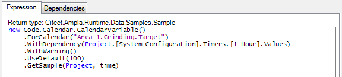
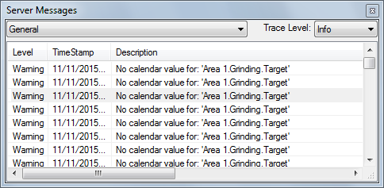

#Calendar Variables#


This Code item will assist in creating a "Calendar Variable".
A "Calendar Variable" will be an calculated variable that will contain the values from the Ampla calendar as a stream. 

##Purpose##

Ampla has the ability to store targets and rates in the Ampla Calendar.

Sometimes it is useful to access these calendars values as though they are a variable.
This code can be used to configure the expression for a Calculated Variable as an "Calendar Variable".

###Features###

* Specify the Calendar item by string or item fullname
* Specify a default value if not provided
* Optional log a warning if no value
* Bad Quality sample when no value
* Specify a stream to assist with dependency

Note:
The Ampla Data Webservices provide an ability to set the Calendar values externally. 

How to use it
===

* Add the code specified in the [code item](CalendarVariable.cs).
* Change the expression that is triggering the result as follows:

Example code: 

``` CSharp
new Code.Calendar.CalendarVariable()
	.ForCalendar("Area 1.Grinding.Target")
	.WithDependency(Project.[System Configuration].Times.[1 Hour].Values)
	.WithWarning()
	.GetSample(time)
	)
```



The resulting stream will can either be a bad quality stream or use a default value.


How it works
===

The code uses a fluent interface to configure the calendar variable.


###```.ForCalendar(string) ``` ###

Ability to specify the name of the Calendar using the method 

Example:
```
new Code.Calendar.CalendarVariable()
	.ForCalendar("Area 1.Grinding.Target")
	.WithDependency(Project.[System Configuration].Timers.[1 Hour].Values)
	.UseDefault(100)
	.GetSample(time)
```

###```.ForItem(item) ```###

Ability to use an item's full name for the target 
new Code.Calendar.CalendarVariable()
	.ForItem(item)
	.WithDependency(Project.[System Configuration].Timers.[1 Hour].Values)
	.UseDefault(100)
	.GetSample(time)
```

###```.WithDepenency(SampleStream) ```###

Allows the automatic configuration of the dependency

```
new Code.Calendar.CalendarVariable()
	.ForCalendar("Area 1.Grinding.Target")
	.WithDependency(Project.[System Configuration].Timers.[1 Hour].Values)
	.UseDefault(100)
	.GetSample(time)
```


###```.UseDefault(double) ```###

If there is no value in the calendar then use the default value 

```
new Code.Calendar.CalendarVariable()
	.ForCalendar("Area 1.Grinding.Target")
	.WithDependency(Project.[System Configuration].Timers.[1 Hour].Values)
	.UseDefault(100)
	.GetSample(time)
```
If there is no calendar configured for the value and there is no default, then a sample with ```Quality.Bad``` will be used.

###```.WithWarning() ```###

If there is no value in the calendar then a warning message will be written out 

```
new Code.Calendar.CalendarVariable()
	.ForCalendar("Area 1.Grinding.Target")
	.WithDependency(Project.[System Configuration].Timers.[1 Hour].Values)
	.WithWarning()
	.UseDefault(100)
	.GetSample(time)
```

If there is no calendar configured for the value then a message will be written.




