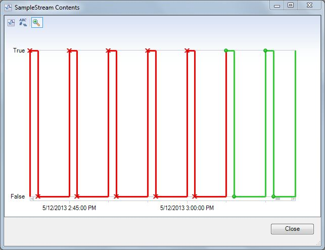
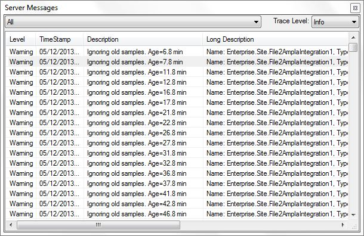

# Ignore Old Samples #

This Code item will allow conditions to ignore old samples that are older than 5 minutes.

## Purpose ##

If you use a timer to trigger some event in Ampla such as an Action item or Plant2Business integration, it is possible to get multiple samples triggered at the same time especially when restarting the service or configuring an item for the first time.

This can cause extra load on startup and cause duplicate records.

## How to use it ##

* Add the code specified in the [code item](Code.Conditions.cs).
* Change the expression that is triggering the result as follows:

``` CSharp
Code.Conditions.IgnoreOldSamples(
 this,
 Enterprise.Site.Timer.Values[time]
)
```

* Set the TraceLevel property to ```Warning```

## How it works ##

When a sample is passed in for evaluation, this code will check the TimeStamp and make it ```Bad``` quality if it is more than 5 minutes old.



If the TraceLevel of the item is set to ```Warning``` or ```Info``` then a message will be sent.



## How to Test ##

* See [Testing instructions](Testing.md)
