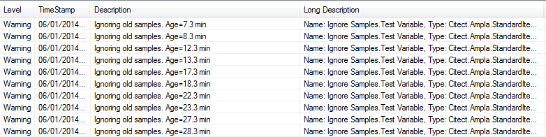

Testing instructions
================

To demonstrate that the code item is working as required, three items will be added to a folder.
* Code item
* Timer
* Test Variable


Setup
===
* Create a new Ampla Project
* Add a folder ```Ignore Samples```
* Add a code item called ```Code```  (Ignore Samples.Code)
* Paste the code from [Code.Condition.cs](Code.Conditions.cs).
* Add a ```PeriodicTimeEvent``` and call it ***Timer***  (Ignore Samples.Timer)
* Set the timer's duration for 1 minute ```00:01:00```
* Set the timer's repeat time for 5 minutes ```00:05:00```
* Save Project
* Start Project

Check the Timer's Values property
===

The Ignore Samples.Timer should have the following sample stream.
 


Test using a Calculated Variable
===
* Add a Calculated Variable called ```Test Variable``` (Ignore Samples.Test Variable)
* Set TraceLevel to ```Warning```
* Set DataType to ```Boolean```
* Set the Historical expression to the following
```CSharp
Code.Conditions.IgnoreOldSamples(
	this,
	Project.[Ignore Samples].Timer.Values[time]
)
```
* Start Test Variable

To validate the code is working correctly
===
If the code is working correctly, you should see the following:
* Messages sent to the Server Messages Window
 

* Bad Samples for values older than 5 minutes
 
