#Operating Time Variables#


This Code item will assist in creating an "Operating Time Variable".
An "Operating Time Variable" will be a calculated variable that will contain the length of time a value has been true for. 

##Purpose##

Sometimes there are circumstances where it is required to calculate the length of time a piece of equipment has been operating for. For example, a production record needs to store the Operating Days field which contains the number of days that a piece of equipment has been operating for.

This code can be used to configure the expression for a Calculated Variable as an "Operating Time Variable".

###Features###

* Specify a boolean stream that contains when the equipment is operating
* Specify a another stream to trigger when to update
* Specify a String StoredVariable to store the status in
* Option to hold a value if the condition is false for a period or reset if it expires.
* Calculate either TotalDays, TotalHours, Total Minutes or TotalSeconds

How to use it
===

* Add the code specified in the [code item (OperatingTimeVariable)](OperatingTimeVariable.cs).
* Add the code specified in the [code item (OperatingTimeCalculator)](OperatingTimeCalculator.cs)
* Add a Stored Variable to store the operating time status in it
* Change the expression that is triggering the result as follows:

Example code: 

``` CSharp
new Code.TimeCalculations.OperatingTimeVariable(this)
	.UsingCondition(Project.Enterprise.Site.Area.Equipment.Trigger.Samples)
	.UpdateEvery(Project.Enterprise.Site.Area.Timer.Values)
	.StoreStatusIn(Project.Enterprise.Site.Area.Equipment.Status)
	.TotalMinutes()
	.ResetAfter(TimeSpan.FromMinutes(5))
	.GetSample(project, time)
```

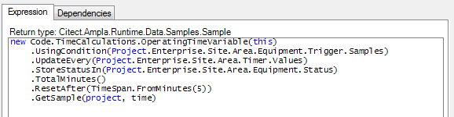

The resulting stream will be either zero or contain the number of minutes that the stream has been true for.  The result will be zero when the trigger is no longer true after 5 minutes.

###Stored Variable for status###

A stored variable is required to store the operating time calculations.

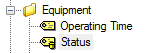

The Stored Variable stores the state, last value and number of ticks since the operating time calculation changed state. It needs to have the following properties set:

```
SampleTypeCode = String
UpdateMode = OnWrite
```

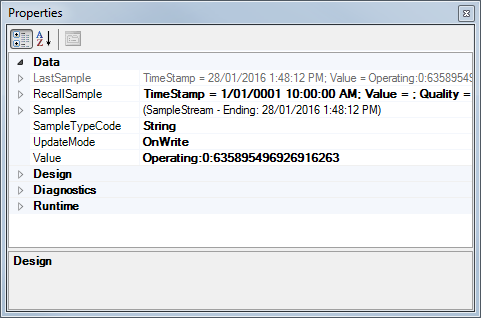

The Status Variable is used in the OperatingTimeVariable using the ```StoreStatusIn()``` method.  

### Trigger Stream ###

By watching the stream specified in the UsingCondition() method, the code will capture the length of time that result has been true.

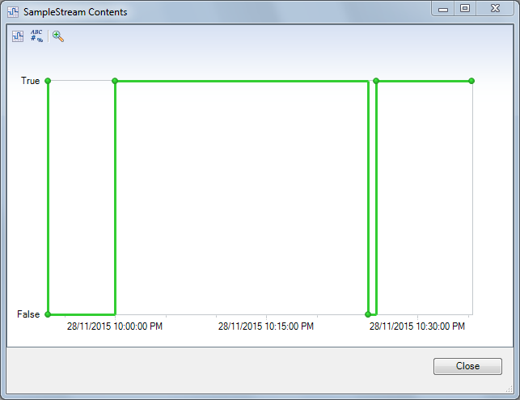

### Operating Day Streams ###

It is possible to calculate the total number of days

``` CSharp
new Code.TimeCalculations.OperatingTimeVariable(this)
	.UsingCondition(Project.Enterprise.Site.Area.Equipment.Trigger.Samples)
	.UpdateEvery(Project.Enterprise.Site.Area.Timer.Values)
	.StoreStatusIn(Project.Enterprise.Site.Area.Equipment.Status)
	.TotalDays()
	.GetSample(project, time)
```

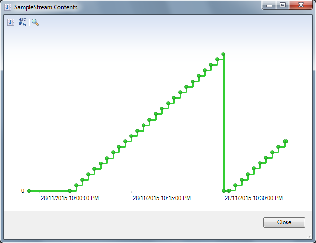

### Operating Hours Stream ###

It is possible to specify the total number of hours

``` CSharp
new Code.TimeCalculations.OperatingTimeVariable(this)
	.UsingCondition(Project.Enterprise.Site.Area.Equipment.Trigger.Samples)
	.UpdateEvery(Project.Enterprise.Site.Area.Timer.Values)
	.StoreStatusIn(Project.Enterprise.Site.Area.Equipment.Status)
	.TotalHours()
	.GetSample(project, time)
```


### Operating Seconds Stream ###

It is possible to capture the number of seconds.

``` CSharp
new Code.TimeCalculations.OperatingTimeVariable(this)
	.UsingCondition(Project.Enterprise.Site.Area.Equipment.Trigger.Samples)
	.UpdateEvery(Project.Enterprise.Site.Area.Timer.Values)
	.StoreStatusIn(Project.Enterprise.Site.Area.Equipment.Status)
	.GetSample(project, time)
```

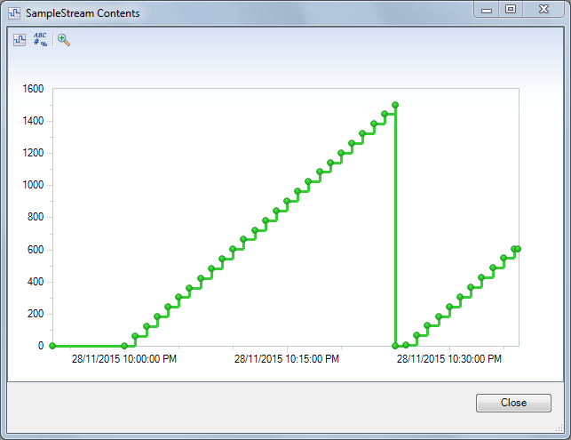


How it works
===

The code uses a fluent interface to configure the Operating Time variable.


###```.UsingCondition(ISampleStream) ``` ###

Using this Sample Stream to search for boolean values

Example:
``` CSharp
new Code.TimeCalculations.OperatingTimeVariable(this)
	.UsingCondition(Project.Enterprise.Site.Area.Equipment.Trigger.Samples)
	.UpdateEvery(Project.Enterprise.Site.Area.Timer.Values)
	.StoreStatusIn(Project.Enterprise.Site.Area.Equipment.Status)
	.TotalDays()
	.GetSample(project, time)
```

###```.StoreStatusIn(StoredVariable)```###

The status of the internal states of the OperatingTimeCalculation will need to be stored in a StoredVariable.  The SampleTypeCode is String and UpdateMode = OnWrite. 

In the following example, the status is stored in a stored variable called "Enterprise.Site.Area.Equipment.Status".
Note that the full item will need to be specified.  

Example:
``` CSharp
new Code.TimeCalculations.OperatingTimeVariable(this)
	.UsingCondition(Project.Enterprise.Site.Area.Equipment.Trigger.Samples)
	.UpdateEvery(Project.Enterprise.Site.Area.Timer.Values)
	.StoreStatusIn(Project.Enterprise.Site.Area.Equipment.Status)
	.TotalDays()
	.GetSample(project, time)
```

It is important that each OperatingTimeVariable calculation have a separate stored variable.

###```.UpdateEvery(ISampleStream) ```###

Ability to use a timer to trigger when to calculate.  This will automatically configure the dependency. 
``` CSharp
new Code.TimeCalculations.OperatingTimeVariable(this)
	.UsingCondition(Project.Enterprise.Site.Area.Equipment.Trigger.Samples)
	.UpdateEvery(Project.Enterprise.Site.Area.Timer.Values)
	.StoreStatusIn(Project.Enterprise.Site.Area.Equipment.Status)
	.TotalDays()
	.GetSample(project, time)
```

The dependency will be automatically configured 

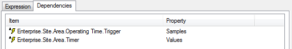


###```.TotalDays() ```###

Calculate the total number of days

```CSharp
new Code.TimeCalculations.OperatingTimeVariable(this)
	.UsingCondition(Project.Enterprise.Area.Equipment.Trigger.Samples)
	.UpdateEvery(Project.[System Configuration].Timers.[1 Hour].Values)
	.StoreStatusIn(Project.Enterprise.Area.Equipment.Status)
	.TotalDays()
	.GetSample(Project, time)
```

If ```.TotalDays()```, ```.TotalHours()``` or ```.TotalMinutes()``` are not specified then the result will be the Total number of seconds.

###```.TotalHours() ```###

Calculate the total number of hours

```CSharp
new Code.TimeCalculations.OperatingTimeVariable(this)
	.UsingCondition(Project.Enterprise.Area.Equipment.Trigger.Samples)
	.UpdateEvery(Project.[System Configuration].Timers.[1 Hour].Values)
	.StoreStatusIn(Project.Enterprise.Area.Equipment.Status)
	.TotalHours()
	.GetSample(Project, time)
```

If ```.TotalDays()```, ```.TotalHours()``` or ```.TotalMinutes()``` are not specified then the result will be the Total number of seconds.

###```.TotalMinutes() ```###

Calculate the total number of minutes

```CSharp
new Code.TimeCalculations.OperatingTimeVariable(this)
	.UsingCondition(Project.Enterprise.Area.Equipment.Trigger.Samples)
	.UpdateEvery(Project.[System Configuration].Timers.[1 Hour].Values)
	.StoreStatusIn(Project.Enterprise.Area.Equipment.Status)
	.TotalMinutes()
	.GetSample(Project, time)
```

If ```.TotalDays()```, ```.TotalHours()``` or ```.TotalMinutes()``` are not specified then the result will be the Total number of seconds.

###```.TotalSeconds() ```###

Calculate the total number of seconds.  

```CSharp
new Code.TimeCalculations.OperatingTimeVariable(this)
	.UsingCondition(Project.Enterprise.Area.Equipment.Trigger.Samples)
	.UpdateEvery(Project.[System Configuration].Timers.[1 Hour].Values)
	.StoreStatusIn(Project.Enterprise.Area.Equipment.Status)
	.TotalSeconds()
	.GetSample(Project, time)
```

If ```.TotalDays()```, ```.TotalHours()``` or ```.TotalMinutes()``` are not specified then the result will be the Total number of seconds.

```CSharp
new Code.TimeCalculations.OperatingTimeVariable(this)
	.UsingCondition(Project.Enterprise.Area.Equipment.Trigger.Samples)
	.UpdateEvery(Project.[System Configuration].Timers.[1 Hour].Values)
	.StoreStatusIn(Project.Enterprise.Area.Equipment.Status)
	.GetSample(Project, time)
```

###```.ResetAfter(TimeSpan) ```###
Specifies that the current value be held if the condition is false.  The TimeSpan will specify how long to hold the value for before resetting.

Example code: 

``` CSharp
new Code.TimeCalculations.OperatingTimeVariable(this)
	.UsingCondition(Project.Enterprise.Site.Area.Equipment.Trigger.Samples)
	.UpdateEvery(Project.Enterprise.Site.Area.Timer.Values)
	.StoreStatusIn(Project.Enterprise.Site.Area.Equipment.Status)
	.TotalMinutes()
	.ResetAfter(TimeSpan.FromMinutes(5))
	.GetSample(project, time)
```
This stream shows the value is held for 5 minutes before resetting.
 
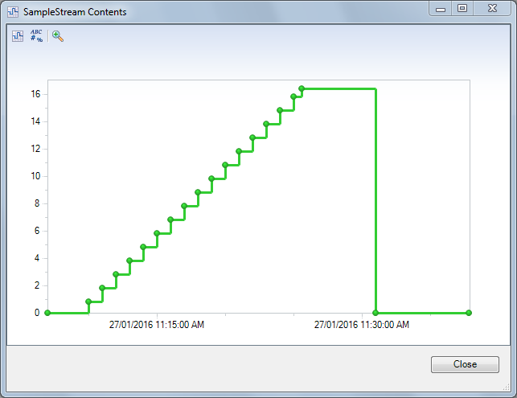 

If the ```.ResetAfter(TimeSpan)``` is not specified, then the value will reset immediately.

###```.GetSample(Project, time) ```###
This method will return a sample calculating the operting time.  The returned sample is used as the result of the CalculatedVariable.

###Error Messages###

####No Condition specified####
A boolean condition will need to be specified to monitor for Operating Time.  When the condition is is True, it is considered to be true.

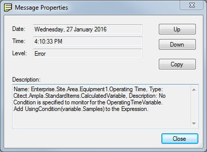

```
Level: Error
Timestamp: 27/01/2016 4:10:33 PM
Name: Enterprise.Site.Area.Equipment.Operating Time, 
Type: Citect.Ampla.StandardItems.CalculatedVariable, 
Description: No Condition is specified to monitor for the Operating Time Variable.
Add UsingCondition(variable.Samples)to the Expression.
```

####No Stored Variable specified####
A Stored Variable is required for each of the OperatingTimeVariables.

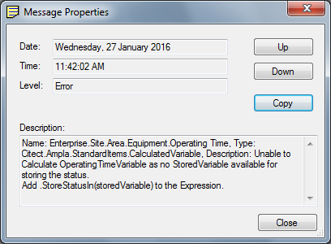 

```
Level: Error
Timestamp: 27/01/2016 11:42:02 AM
Name: Enterprise.Site.Area.Equipment.Operating Time, 
Type: Citect.Ampla.StandardItems.CalculatedVariable, 
Description: Unable to Calculate OperatingTimeVariable as no StoredVariable available for storing the status.
Add .StoreStatusIn(storedVariable) to the Expression.
```

####Stored Variable SampleTypeCode must be String####
The Stored Variable will be storing a string in the Status so the SampleTypeCode must be String.

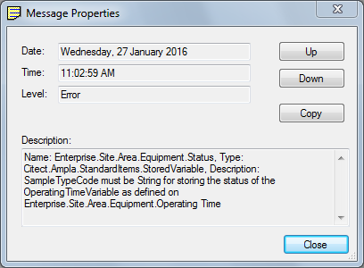 

```
Level: Error
Timestamp: 27/01/2016 10:50:59 AM
Name: Enterprise.Site.Area.Equipment.Status, 
Type: Citect.Ampla.StandardItems.StoredVariable, 
Description: SampleTypeCode must be String for storing the status of the OperatingTimeVariable as defined on Enterprise.Site.Area.Equipment.Operating Time
```


####Stored Variable UpdateMode must be OnWrite####
The Stored Variable will have the Status written by the Calculation code and must be able to write the values.

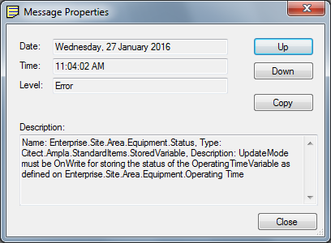 

```
Level: Error
Timestamp: 27/01/2016 11:04:02 AM
Name: Enterprise.Site.Area.Equipment.Status, 
Type: Citect.Ampla.StandardItems.StoredVariable, 
Description: UpdateMode must be OnWrite for storing the status of the OperatingTimeVariable as defined on Enterprise.Site.Area.Equipment.Operating Time
```

###Debug TraceMessages###

It is possible to set the TraceLevel=Verbose of the CalculatedVariable to get the state changes to be logged to the Server Messages window and the Ampla EventLog.

The messages show the old state and new state and the last value in brackets.  In the messages below it can be seen that that state change went from Operating to Hold and the last value was 22.86694.  The state went again to Operating and back to Hold again.

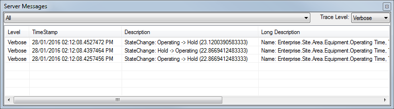 

 