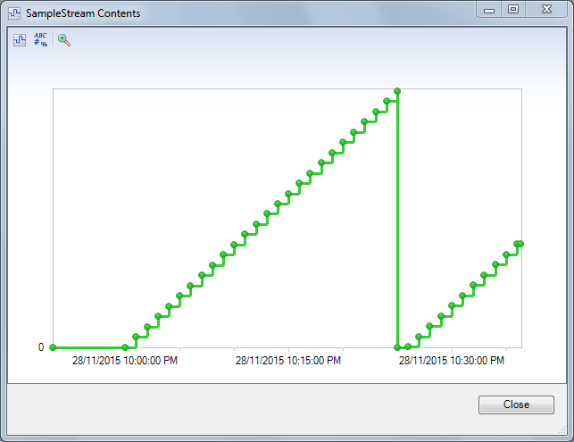
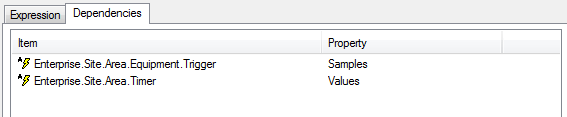

#Operating Time Variables#


This Code item will assist in creating an "Operating Time Variable".
An "Operating Time Variable" will be an calculated variable that will contain the length of time a value has been true for. 

##Purpose##

Sometimes there are circumstances where it is required to calculate the length of time a piece of equipment has been operating for. For example, a production record needs to store the Operating Days field which contains the number of days that a piece of equipment has been operating for.

This code can be used to configure the expression for a Calculated Variable as an "Operating Time Variable".

###Features###

* Specify a boolean stream that contains when the equipment is operating
* Specify a another stream to trigger when to update

How to use it
===

* Add the code specified in the [code item](OperatingTimeVariable.cs).
* Change the expression that is triggering the result as follows:

Example code: 

``` CSharp
new Code.TimeCalculations.OperatingTimeVariable()
	.Using(Project.Enterprise.Area.[Operating Time].Trigger)
	.UpdateEvery(Project.[System Configuration].Timers.[1 Hour].Values)
	.TotalHours()
	.GetSample(Project, time)
```


The resulting stream will be either zero or contain the number of hours that the stream has been true for.  The result will be zero when the trigger is no longer true.

### Trigger Stream ###

By watching the stream specified in the Using() method, the code will capture the length of time that result has been true.


### Operating Day Streams ###

It is possible to calculate the total number of days

``` CSharp
new Code.TimeCalculations.OperatingTimeVariable()
	.Using(Project.Enterprise.Area.[Operating Time].Trigger)
	.UpdateEvery(Project.[System Configuration].Timers.[1 Hour].Values)
	.TotalDays()
	.GetSample(Project, time)
```


### Operating Hours Stream ###

It is possible to specify the total number of hours

``` CSharp
new Code.TimeCalculations.OperatingTimeVariable()
	.Using(Project.Enterprise.Area.[Operating Time].Trigger)
	.UpdateEvery(Project.[System Configuration].Timers.[1 Hour].Values)
	.TotalHours()
	.GetSample(Project, time)
```




### Operating Seconds Stream ###

It is possible to capture the number of seconds.

``` CSharp
new Code.TimeCalculations.OperatingTimeVariable()
	.Using(Project.Enterprise.Area.[Operating Time].Trigger)
	.UpdateEvery(Project.[System Configuration].Timers.[1 Hour].Values)
	.GetSample(Project, time)
```


How it works
===

The code uses a fluent interface to configure the Operating Time variable.


###```.Using(ISampleStream) ``` ###

Using this Sample Stream to search for boolean values

Example:
``` CSharp
new Code.TimeCalculations.OperatingTimeVariable()
	.Using(Project.Enterprise.Area.[Operating Time].Trigger)
	.UpdateEvery(Project.[System Configuration].Timers.[1 Hour].Values)
	.TotalHours()
	.GetSample(Project, time)
```

###```.UpdateEvery(ISampleStream) ```###

Ability to use a timer to trigger when to calculate.  This will automatically configure the dependency. 
``` CSharp
new Code.TimeCalculations.OperatingTimeVariable()
	.Using(Project.Enterprise.Area.[Operating Time].Trigger)
	.UpdateEvery(Project.[System Configuration].Timers.[1 Hour].Values)
	.TotalHours()
	.GetSample(Project, time)
```

The dependency will be automatically configured 



###```.TotalHours() ```###

Calculate the total number of hours

```CSharp
new Code.TimeCalculations.OperatingTimeVariable()
	.Using(Project.Enterprise.Area.[Operating Time].Trigger)
	.UpdateEvery(Project.[System Configuration].Timers.[1 Hour].Values)
	.TotalHours()
	.GetSample(Project, time)
```

If .TotalHours() or .TotalDays() are not specified then the result will be the Total number of seconds.

###```.TotalDays() ```###

Calculate the total number of days

```CSharp
new Code.TimeCalculations.OperatingTimeVariable()
	.Using(Project.Enterprise.Area.[Operating Time].Trigger)
	.UpdateEvery(Project.[System Configuration].Timers.[1 Hour].Values)
	.TotalDays()
	.GetSample(Project, time)
```

If .TotalHours() or .TotalDays() are not specified then the result will be the Total number of seconds.

